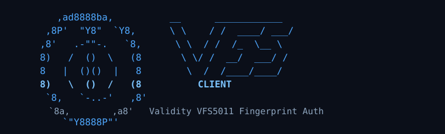
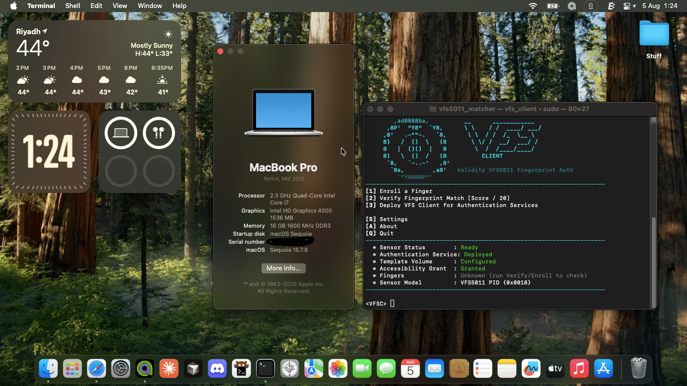
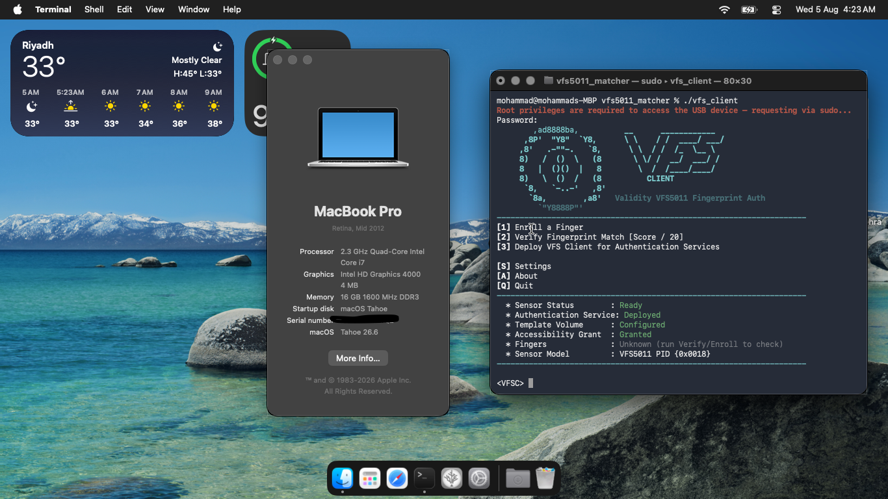

<p align="center">
  
</p>

<h3 align="center">VFS5011 Fingerprint Daemon for macOS</h3>

<p align="center">
  A libusb-based capture pipeline and NBIS matcher bringing Validity VFS5011
  fingerprint authentication to macOS on unsupported (Hackintosh) hardware —
  lock screen unlock and System Settings authentication prompts, driven by
  a real fingerprint sensor instead of a password.
  
  * Current version: v1.0.2 | August 13th 2026 
</p>

---

## Overview

This project ports the USB capture protocol for the Validity Sensors
VFS5011 fingerprint reader (USB VID `138A`, PID `0018`) to standalone
macOS C code, and pairs it with NIST's NBIS fingerprint matching suite
(`mindtct` for minutiae extraction, `bozorth3` for matching) to provide
working fingerprint authentication on Hackintosh hardware that shipped
with this sensor but has no native macOS driver support.

It is not a kernel extension or a libfprint port. It runs as a small
background daemon that watches for authentication prompts using the
Accessibility APIs, captures a fingerprint swipe on demand, matches it
against enrolled templates, and — on a match — types the stored password
into the prompt automatically.

Confirmed working end-to-end on macOS Sequoia and macOS Tahoe, on an
Ivy Bridge Hackintosh laptop. (HP Pavilion dv6-7070ex with a VFS5011 Fingerprint Sensor)

## Features

- Fingerprint capture and matching entirely native to macOS, no Linux
  kernel driver or libfprint dependency at runtime
- Multi-finger enrollment (multiple fingers, best-match-wins verification)
- Lock screen unlock via fingerprint swipe
- System Settings / System Preferences authentication sheet ("padlock")
  unlock via fingerprint swipe
- Passwords.app lock screen unlock via fingerprint swipe
- Keychain Access "confidential information" consent prompt unlock via fingerprint swipe
- Enrolled templates and the stored password are kept on a dedicated,
  encrypted APFS volume, not in plaintext on the boot volume
- Self-elevating daemon with a narrowly scoped, single-purpose sudoers
  rule rather than a blanket NOPASSWD grant
- Interactive terminal client (`vfs_client`) for enrollment, verification,
  and one-command deployment of the background daemon
-  **Optional** Menu bar Application for disabling, enabling, Restarting the Daemon + sends notifications when authentication is ready if Sensor light is too dim / too slow
  ## Screenshots

  <p align="center">   </p> <p align="center"><em>vfs_client running on macOS Sequoia 15.7.8 (24G824) (left), and macOS Tahoe 26.6 (25G72) (right)</em></p>


  * Please keep in mind that macOS tahoe Currently is **NOT supported by OpenCore legacy patcher.** Things may change when we have graphic acceleration But until then, the image for tahoe is a **proof-of-concept.**
  * Also Please keep in mind that the minimum version is macOS 15 Sequoia. Other older versions may work, but I offer **0 support for them** when using a version older than sequoia (Darwin 24.0.0) you are on your own


## Menu Bar Companion App (optional)

`vfs5011-menubar/` contains an optional menu bar app that surfaces the
daemon's auth events as real notifications — useful since the sensor's
LED can be too dim to notice on its own.

- Notifies you the moment the daemon wants a swipe ("Swipe to
  authenticate! 🫆"), then whether it succeeded or failed
- One-click toggle to pause/resume fingerprint auth without touching Terminal
- Registers itself as a login item automatically on first launch (macOS
  13+, via `SMAppService` — no manual LaunchAgent setup needed)
- "About VFS5011" menu item with a short project summary and a link back
  here

Completely optional — the daemon works identically with or without it
running.

### Installing

```bash
cd vfs5011-menubar
chmod +x build_menubar_app.sh
./build_menubar_app.sh
open "build/VFS5011 Menu Bar.app"
```

Requires Xcode Command Line Tools (`xcode-select --install`) for `swiftc`
and `iconutil`. No other dependencies. And it needs **macOS 15 Sequoia and later** same like the Daemon, Older versions may work but I don't know if they do you are on your own if you are on Sonoma and older.

First launch will be blocked by Gatekeeper since this is ad-hoc signed,
not notarized with a paid Apple Developer account — right-click the app →
**Open** → **Open** again, or run `xattr -cr "VFS5011 Menu Bar.app"` once.

### Wiring it to the daemon

The menu bar app talks to the daemon over macOS distributed
notifications — the same mechanism the daemon already uses for its own
`screenIsLocked`/`screenIsUnlocked` handling. **The daemon needs a small
patch to actually send those events**; see
[`vfs5011-menubar/daemon-patch/README.md`](vfs5011-menubar/daemon-patch/README.md)
for the exact 6-line diff against `vfs5011_daemon.c`. Without the patch,
the app runs standalone and just never receives anything — harmless, but
silent.

Known limitations:

- Pause/resume is global — disabling fingerprint auth pauses it for every
  recognized prompt at once (lock screen, padlock, Finder, pkg installer,
  Time Machine, Apple ID's local password step), not just one surface.
- Not notarized (see Gatekeeper note above).


## Requirements 
- A Validity Sensors VFS5011 fingerprint reader (USB `138A:0018`)
- Xcode Command Line Tools (`xcode-select --install`)
- [Homebrew](https://brew.sh)
- `libusb` (`brew install libusb`)
- Accessibility permission granted to the daemon (handled automatically
  by the deploy script, see below)
- OpenCore v1.0.6 or later (For maximum Security | Release or Debug are fine) but on older versions of OpenCore will work but I don't support it. You are on your own if you use v1.0.5 or older.

## Building

```bash
git clone https://github.com/hackintosh-user/VFS5011-hackintosh.git
cd vfs5011-hackintosh-main
chmod +x prep_and_build.sh
./prep_and_build.sh
```

This produces two binaries in the project directory:

- `vfs_client` — the interactive menu used for enrollment, verification,
  and deployment
- `vfs5011_daemon` — the background daemon that watches for
  authentication prompts and performs the fingerprint check

`ax_probe`, a standalone Accessibility-API diagnostic tool used during
development, is not built by `build.sh`. It has no dependency on
`libusb` or NBIS and can be built on its own if needed:

```bash
clang ax_probe.c -o ax_probe -framework CoreFoundation -framework ApplicationServices
```

## Usage

**WARINING 1**: On macOS 14 sonoma And older you will be shown a message that clearly states there is **0 Support for any OS older than macOS 15 Sequoia and macOS Tahoe 26** you are on your own for any issues that may arise on this version of macOS.

**WARNING 2**: Same goes for the OpenCore Boot loader: the minimum version is OpenCore v1.0.6 or later. v1.0.5 and older are officially not supported. You are on your own if you encounter any issues on v1.0.5 or older.

Run the client with this command:

```bash
sudo ./vfs_client
```
Then, you should be greeted with this **interactive CLI menu for VFS client**
```
[1] Enroll a Finger
[2] Verify Fingerprint Match [Score / 20]
[3] Deploy VFS Client for Authentication Services

[S] Settings
[A] About
[Q] Quit
```

- **Enroll a Finger** — captures several swipes of a finger and stores
  them as a named template on the encrypted volume. Repeat for as many
  fingers as needed; enrollment is capped and uses best-match-wins
  verification across all enrolled fingers.
- **Verify Fingerprint Match** — a standalone test of the capture and
  matching pipeline, independent of the daemon, useful for confirming
  the sensor and templates are working before deploying.
- **Deploy VFS Client for Authentication Services** — rebuilds the
  daemon from source, installs it as a per-user LaunchAgent, re-signs it
  and regenerates its Accessibility permission grant, and installs a
  narrowly scoped sudoers rule so the daemon can self-elevate when it
  needs root access to the USB device. This step is re-run every time
  you deploy, so the daemon is never left running a stale build.

Once deployed, the daemon runs continuously in the background. At the
lock screen, or when a System Settings authentication sheet appears, it
prompts for a fingerprint swipe and, on a match, types the stored
password automatically.

## How it works

- **Capture**: the VFS5011's raw USB protocol (initialization sequence,
  swipe capture, image reassembly) is implemented directly against
  `libusb`, without going through any Linux-specific driver stack.
- **Matching**: captured swipes are run through NIST's `mindtct` for
  minutiae extraction and `bozorth3` for match scoring, both compiled
  directly into the client and daemon.
- **Storage**: enrolled templates and the authentication password live
  on a dedicated, encrypted APFS volume rather than in a plaintext file
  on the boot volume. The passphrase for that volume is stored in the
  System keychain.(Not seen by finder or the user)
- **Detection**: the daemon polls the system's focused UI element via
  the Accessibility APIs to recognize when a lock screen or System
  Settings password field is active, rather than hooking or patching
  any system process.
- **Privilege model**: the daemon runs as the console user and only
  escalates to root, via a narrowly scoped sudoers rule, for the
  specific operations that require it (accessing the USB device). It is
  not installed as a system-wide LaunchDaemon.

## Tested configurations

| macOS Version | Result |
|---|---|
| Sequoia | Lock screen and padlock unlock confirmed working |
| Tahoe | Lock screen and padlock unlock confirmed working (separate test volume) |

Tested on an Intel Ivy Bridge Hackintosh laptop (HP Pavilion DV6/EliteBook
class hardware) with the VFS5011 sensor at USB `138A:0018`.

## Limitations

- macOS only. This is not a libfprint driver and is not intended to run
  on Linux — if you're on Linux with this sensor, use the existing
  open-source libfprint driver directly instead (see Acknowledgments).
- Targets macOS Sequoia and later only; the client prints a warning if
  run on an older Darwin version.
- No PAM module exists for `sudo` in a terminal. An Accessibility-based
  approach for `sudo` prompts was prototyped during development and
  intentionally removed to keep scope limited to lock screen and System
  Settings authentication.
- Ad hoc code signing is used for the daemon binary and its
  Accessibility grant, both regenerated on every deploy. There is no
  notarization or Developer ID signing.
- a Cold boot sign in is not supported yet. locking the screen / screen saver starts is supported
- The sensor Takes some **time to fully start the scan (Show the white light)** currently unknown why. Please watch the sensor closely until this issue is resolved.

## Acknowledgments

This project would not exist without the following prior work:

- **NBIS (mindtct, bozorth3)** — the fingerprint minutiae extraction and
  matching engine used in this project is NIST's public NBIS
  distribution. Developed by employees of the U.S. federal government
  in the course of their official duties and, per 17 U.S.C. section 105,
  not subject to copyright protection in the United States.
  https://www.nist.gov/services-resources/software/nist-biometric-image-software-nbis

- **VFS5011 capture protocol** — the USB initialization and capture
  sequence for the VFS5011 sensor was originally implemented as a
  libfprint driver by Arseniy Lartsev and AceLan Kao (Canonical),
  licensed under the GNU Lesser General Public License v2.1. This
  project's macOS capture pipeline was independently written in C,
  informed by that original driver's protocol logic.
  https://github.com/ars3niy/fprint_vfs5011

If you are on Linux and have a VFS5011 sensor, the libfprint driver
linked above is the right tool to use directly — this project exists
specifically to bring the same capability to macOS, where no equivalent
driver exists.

## License

Released under the BSD 3-Clause License. See [LICENSE](LICENSE) for
the full text, including third-party attribution for NBIS and the
VFS5011 capture protocol.
